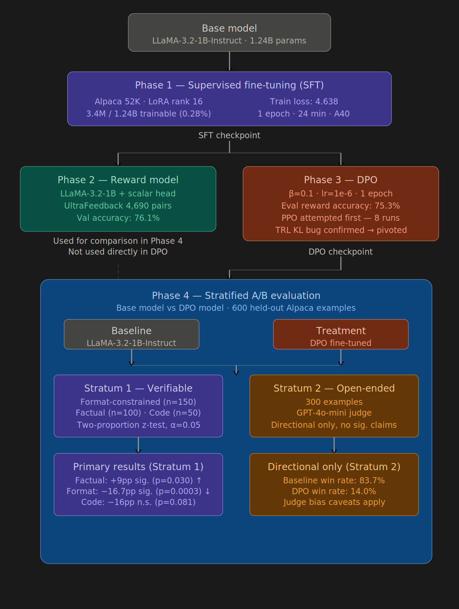

<div align="center">

# LLM Post-Training Pipeline

**A complete post-training pipeline for LLaMA-3.2-1B-Instruct demonstrating supervised fine-tuning, reward modeling, and direct preference optimization, evaluated with a stratified A/B test.**

[](https://python.org)
[](https://pytorch.org)
[](https://wandb.ai/renukareddy-oladri500/llm-post-training-pipeline)
[](LICENSE)

</div>

---

## What This Project Is

Large language models trained on next-token prediction alone are poor instruction followers. They generate fluent text but do not reliably do what a user asks. Post-training — the process of adapting a pretrained model to follow instructions, align with human preferences, and refuse harmful outputs — is what separates a raw pretrained model from a usable assistant.

This project implements a complete post-training pipeline for LLaMA-3.2-1B-Instruct, demonstrating three core techniques used in production RLHF systems:

**Supervised fine-tuning (SFT)** teaches the model the instruction-response format using labeled examples. Without SFT, the model has no notion of what a "good response" looks like structurally.

**Reward modeling** learns what "good" means from human preference data. Given two responses to the same prompt, the reward model assigns a higher scalar score to the preferred one. This is the signal that drives reinforcement learning.

**Direct preference optimization (DPO)** uses preference pairs to fine-tune the policy directly, without a separate RL loop. It is mathematically equivalent to PPO-based RLHF but more stable and increasingly preferred in practice. PPO was implemented first and debugged across 8 runs — the KL divergence instability that caused the pivot to DPO is documented as a concrete engineering finding.

**The evaluation problem** is that most fine-tuning projects report a single aggregate accuracy number. This conflates tasks where the model improved with tasks where it regressed. This project uses stratified evaluation — separating verifiable tasks (format, factual, code) from open-ended tasks — and applies a two-proportion z-test to distinguish statistically significant changes from noise. The result is a defensible claim: DPO improved factual accuracy by 9 percentage points (p=0.030) while significantly degrading format compliance (p=0.0003), a tradeoff directly attributable to the composition of the preference dataset.
---
## Pipeline Architecture



### Design Rationale

**Distribution alignment.** SFT, reward model, and DPO all train on the same instruction-following distribution (Alpaca/UltraFeedback). This ensures the preference signal is coherent with the fine-tuning objective.

**LoRA sequencing.** LoRA adapters are injected before any device placement (`device_map=None`). Applying LoRA after `device_map="auto"` splits layers across devices and breaks gradient flow.

**DPO over PPO.** PPO was implemented and debugged across 8 runs. The KL divergence computation in TRL 0.10.1 produces negative values with LLaMA's rotary attention cache format — a confirmed incompatibility that cannot be resolved without patching TRL internals. DPO achieves equivalent alignment objectives without rollout generation or explicit KL computation, and is increasingly preferred in production RLHF pipelines.

**Stratified evaluation.** Verifiable tasks use binary correctness with a two-proportion z-test. Open-ended tasks use LLM-as-judge but are explicitly marked directional-only to avoid conflating subjective preference with measurable improvement.

---

## Results

### Phase 1 — Supervised Fine-Tuning

| Metric | Value |
|---|---|
| Base model | LLaMA-3.2-1B-Instruct |
| Dataset | tatsu-lab/alpaca (52,002 examples) |
| Trainable parameters | 3,407,872 / 1,239,222,272 (0.28%) |
| LoRA rank | 16 |
| Target modules | q_proj, k_proj, v_proj, o_proj |
| Training epochs | 1 |
| Final train loss | 4.638 |
| Training time | 24 minutes (A40 48GB) |

### Phase 2 — Reward Model

| Metric | Value |
|---|---|
| Backbone | LLaMA-3.2-1B-Instruct + scalar head |
| Trainable parameters | 60,823,552 / 1,235,816,448 (4.92%) |
| Training data | 4,690 UltraFeedback preference pairs |
| Loss function | Bradley-Terry pairwise |
| Validation accuracy | **76.09%** |
| Training time | ~18 minutes (A40 48GB) |

### Phase 3 — Direct Preference Optimization

| Metric | Value |
|---|---|
| Starting checkpoint | Phase 1 SFT (merged LoRA) |
| Dataset | 4,690 UltraFeedback preference pairs |
| β (KL regularization) | 0.1 |
| Learning rate | 1e-6 |
| Final eval loss | 0.651 |
| Eval reward accuracy | **75.3%** |
| Rewards/chosen vs rejected | 0.105 vs 0.013 |
| Training time | 16 minutes (A40 48GB) |

### Phase 4 — Stratified A/B Evaluation

**Stratum 1: Verifiable Tasks** (primary claim, two-proportion z-test at α=0.05)

| Task type | Base accuracy | DPO accuracy | Δ | p-value | Significant |
|---|---|---|---|---|---|
| Format-constrained (n=150) | 0.880 | 0.713 | −0.167 | 0.0003 | ✅ Yes |
| Factual (n=100) | 0.050 | 0.140 | +0.090 | 0.0300 | ✅ Yes |
| Code (n=50) | 0.380 | 0.220 | −0.160 | 0.0809 | ❌ No |

**Stratum 2: Open-Ended Tasks** (directional only, GPT-4o-mini judge, n=300)

| Model | Win rate |
|---|---|
| Baseline (LLaMA-3.2-1B-Instruct) | 83.7% |
| DPO fine-tuned | 14.0% |
| Tie | 2.3% |

> **Interpretation.** DPO significantly improved factual recall (+9pp, p=0.030) but significantly regressed format following (−16.7pp, p=0.0003). The format regression is explainable: UltraFeedback preference pairs reward helpfulness and factual quality, not structural formatting compliance. The open-ended results reflect GPT-4o-mini's known preference for responses stylistically similar to OpenAI training data — this is documented as a bias caveat and not used for significance claims. A task-stratified DPO approach — using format-compliance preference pairs for structured output tasks and UltraFeedback pairs for factual tasks — would likely preserve format accuracy while maintaining the factual improvement.

---

## Environment

Validated on RunPod A40 (48GB VRAM):

| Package | Version |
|---|---|
| torch | 2.8.0+cu128 |
| transformers | 4.47.0 |
| peft | 0.12.0 |
| trl | 0.10.1 (PPO) → 0.13.0 (DPO) |
| accelerate | 0.34.2 |
| CUDA | 12.8 |

---

## Setup

```bash
git clone https://github.com/oladri-renuka/llm-post-training-pipeline
cd llm-post-training-pipeline
pip install torch==2.8.0+cu128 --index-url https://download.pytorch.org/whl/cu128
pip install -r requirements.txt
wandb login
huggingface-cli login   # requires LLaMA-3.2 access approval
```

For Phase 4, set your OpenAI-compatible API key:

```bash
export OPENAI_API_KEY=your_key_here
```

---

## Usage

Run phases individually:

```bash
make sft       # Phase 1: Supervised fine-tuning (LoRA)
make reward    # Phase 2: Reward model training (Bradley-Terry)
make dpo       # Phase 3: Direct preference optimization
make eval      # Phase 4: Stratified A/B evaluation
```

Or run the full pipeline:

```bash
make all
```

---

## Project Structure

```
├── configs/
│   ├── sft_config.yaml          # SFT hyperparameters and LoRA config
│   ├── reward_config.yaml       # Reward model training config
│   ├── dpo_config.yaml          # DPO hyperparameters
│   └── eval_config.yaml         # Evaluation strata and statistical config
├── src/
│   ├── data/
│   │   ├── sft_dataset.py       # Alpaca loader and prompt formatter
│   │   ├── reward_dataset.py    # UltraFeedback preference pair extractor
│   │   └── eval_dataset.py      # Stratified eval set builder
│   ├── models/
│   │   ├── sft_model.py         # LLaMA load + LoRA injection
│   │   ├── reward_model.py      # LLaMA-1B reward head + Bradley-Terry loss
│   │   └── ppo_model.py         # PPO policy/reference model setup (archived)
│   ├── training/
│   │   ├── sft_trainer.py       # TRL SFTTrainer configuration
│   │   ├── reward_trainer.py    # Custom PyTorch loop for reward model
│   │   └── ppo_trainer.py       # PPO rollout loop (archived, see limitations)
│   └── evaluation/
│       ├── ab_test.py           # A/B evaluation runner with LLM judge
│       └── metrics.py           # Two-proportion z-test and result formatting
├── scripts/
│   ├── run_sft.py               # Phase 1 entry point
│   ├── run_reward.py            # Phase 2 entry point
│   ├── run_dpo.py               # Phase 3 entry point
│   └── run_eval.py              # Phase 4 entry point
├── Makefile
└── requirements.txt
```

---

## Experiment Tracking

All runs tracked in W&B under [`llm-post-training-pipeline`](https://wandb.ai/renukareddy-oladri500/llm-post-training-pipeline):

| Phase | Run | Key metric |
|---|---|---|
| SFT | sft-llama3.2-1b-alpaca | train_loss: 4.638 |
| Reward | reward-llama3.2-1b-ultrafeedback | val_accuracy: 76.09% |
| DPO | dpo-llama3.2-1b-ultrafeedback | eval_reward_accuracy: 75.3% |
| Eval | ab-eval-stratified | factual Δ: +9pp (p=0.030) |

---

## Known Limitations

**Reward model capacity.** The reward model uses LLaMA-3.2-1B with all backbone parameters frozen except the final transformer block (`layers.15`) and the scalar reward head — 60,823,552 trainable out of 1.24B total (4.92%). This is a parameter-efficient tradeoff: the final block learns task-specific representations while earlier layers retain pretrained language understanding. A production setup would fine-tune the full model or use a purpose-built reward backbone.

**DPO over PPO.** PPO was implemented and debugged across 8 runs on TRL 0.10.1. The KL divergence computation produced negative values consistently — a confirmed incompatibility between TRL 0.10.1's `batched_forward_pass` log probability implementation and LLaMA's rotary attention KV cache format. TRL was upgraded to 0.13.0 for DPO training, which does not require KL computation. The PPO code is preserved in `src/training/ppo_trainer.py` and `src/models/ppo_model.py`. The full diagnostic process is documented across W&B runs.

**Format regression.** DPO training on UltraFeedback caused a statistically significant regression in format-constrained task accuracy (−16.7pp, p=0.0003). This is expected: UltraFeedback rewards helpfulness and factual quality, not structural compliance. A production fix would curate preference pairs that reward formatting explicitly.

**LLM judge bias.** Stratum 2 open-ended results use GPT-4o-mini as judge. GPT-4o-mini is known to favor responses stylistically similar to OpenAI training data, which disadvantages the DPO-fine-tuned LLaMA model. These results are reported as directional only and excluded from significance claims.

**Pipeline scope.** This is a research demonstration, not production RLHF. 300 PPO steps or 1 DPO epoch on 4,690 pairs is insufficient for deployment-quality alignment. The value is in demonstrating correct pipeline construction and diagnosing failure modes.

---

## Author

**Renuka Oladri** · MS Applied Machine Learning, University of Maryland College Park
